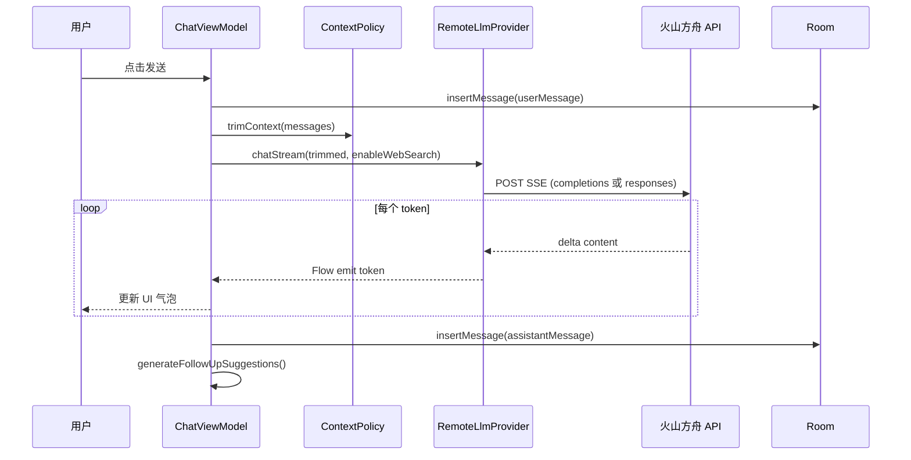
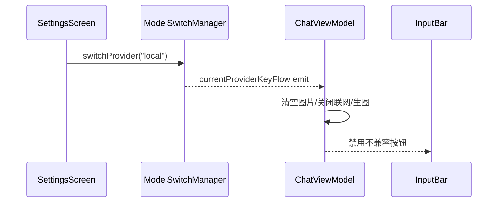

# DoubaoApp 功能实现技术文档

> 本文档基于源码分析，说明各功能模块的实现方式、数据流与关键设计决策。  
> 适用读者：需要理解或二次开发本项目的 Android / AI 工程师。

---

## 1. 项目概览

DoubaoApp 是一款仿豆包风格的 Android AI 聊天助手，核心特点是**同一 App 内可在远端大模型与本地 llama.cpp 之间切换**，并围绕聊天场景集成了联网搜索、多模态识图、图片生成、语音识别与播报等能力。

| 维度 | 选型 |
|------|------|
| 语言 | Kotlin |
| UI | Jetpack Compose + Material 3 |
| 架构 | 单 Activity + ViewModel + Repository + Provider 抽象 |
| 本地存储 | Room |
| 网络 | OkHttp（SSE / WebSocket / REST） |
| 远端 LLM | 火山方舟 OpenAI 兼容 API |
| 端侧推理 | llama.cpp（`:llama-android-lib` JNI 模块） |
| 凭证 | EncryptedSharedPreferences |

**环境要求**：Android 13+（`minSdk 33`），真机建议 arm64-v8a、RAM ≥ 8 GB。

---

## 2. 整体架构

### 2.1 分层结构

```
┌─────────────────────────────────────────────────────────────┐
│  UI 层（Compose）                                            │
│  SessionListScreen · ChatScreen · SettingsScreen · Benchmark │
└───────────────────────────┬─────────────────────────────────┘
                            ▼
┌─────────────────────────────────────────────────────────────┐
│  ChatViewModel（ChatUiState 单一状态源）                      │
│  发送/重试/语音/生图编排 · 流式 UI 更新 · 消息互动             │
└───────┬─────────────────┬──────────────────┬──────────────┘
        ▼                 ▼                  ▼
 ModelSwitchManager   ChatRepository    SlidingWindowPolicy
 remote ⟷ local       Room 持久化        上下文裁剪
        │
   ┌────┴────────────────────────────────────────┐
   ▼                                             ▼
RemoteLlmProvider                          LocalLlmProvider
· SSE 对话 / 联网 / 识图                      · GGUF 加载 / JNI 推理
ArkImageClient · VolcSpeech · VolcTts        LocalLlmBenchmark
```

### 2.2 依赖装配（无 DI 框架）

`DoubaoApp` 作为 Application 级服务定位器，在 `onCreate()` 中完成所有依赖初始化：

- Room 数据库与 `ChatRepository`
- `LocalLlmProvider` + `ModelSwitchManager`（注册 `remote` / `local` 两个 Provider）
- `SlidingWindowPolicy`（保留最近 20 条消息）
- `SettingsPrefs` 读取已保存配置
- `reconfigureRemoteServices()` 热更新远端 Provider 与语音服务

设置页保存 API Key 后调用 `reconfigureRemoteServices()`，**无需重启 App** 即可生效。

### 2.3 Provider 抽象

`LlmProvider` 接口统一了远端与本地推理入口：

```kotlin
fun chatStream(messages, contextPolicy, enableWebSearch): Flow<String>
suspend fun chatCompletion(...): String
fun supportsImage(): Boolean
fun supportsToolUse(): Boolean
fun modelName(): String
fun modelSource(): String  // "remote" | "local"
```

`ChatViewModel` 只依赖 `LlmProvider`，不感知具体实现，模型切换对业务层透明。

### 2.4 导航路由

`MainScreen` 使用 Navigation Compose 定义四条路由：

| 路由 | 页面 | 职责 |
|------|------|------|
| `sessionList` | 会话列表（首页） | 展示/创建/删除会话 |
| `chat/{sessionId}` | 聊天页 | 消息流、输入栏、互动 |
| `settings` | 设置页 | Key、接入点、模型来源、GGUF |
| `localLlmBenchmark` | 性能评测 | 端侧 benchmark 报告 |

---

## 3. 功能实现详解

### 3.1 多会话管理

**实现位置**：`SessionListScreen` + `ChatRepository` + Room `sessions` 表

**流程**：

1. 会话列表通过 `repository.getAllSessions()` 以 `Flow` 形式订阅，按 `updatedAt` 倒序展示。
2. 用户点击会话 → 导航到 `chat/{sessionId}` → `ChatViewModel.loadSession(sid)` 清空 UI 消息并重新从 DB 加载。
3. 用户发送首条消息时，`ChatViewModel.sendMessage()` 调用 `repository.insertSession()`，标题取用户输入前 20 字。
4. 新建会话：`createNewSession()` 生成新 UUID，清空消息列表。

**会话实体**（`SessionEntity`）：

```kotlin
id: String, title: String, createdAt: Long, updatedAt: Long
```

**设计要点**：每个 `ChatScreen` 实例绑定一个 `sessionId`；`ChatViewModel` 在 `loadSession` 时切换当前会话上下文，消息查询均带 `sessionId` 过滤。

---

### 3.2 文本对话与流式输出

**实现位置**：`ChatViewModel.sendMessage()` → `LlmProvider.chatStream()` → UI `StateFlow` 更新

**发送流程**：

```
用户点击发送
  → 校验（本地模式 / Key 配置 / 生图模式分流）
  → 构建 userMessage + 占位 aiMessage（isStreaming=true）
  → 即时写入 Room（仅 userMessage）
  → contextPolicy.trimContext() 裁剪历史
  → provider.chatStream() 收集 token
  → 逐 token 更新 aiMessage.content
  → 流结束：isStreaming=false，insert 助手消息
  → generateFollowUpSuggestions()
```

**流式 UI 更新**：`ChatViewModel` 在 `collect { token }` 回调中通过 `StateFlow.update` 按 `aiMessageId` 定位并追加内容，Compose 自动重组 `MessageItem`。

**加载状态**：`ChatUiState.isLoading` 在流式期间为 `true`，禁止重复发送；`MessageItem` 根据 `isStreaming` 显示打字光标效果。

**错误处理**：SSE / JNI 异常时，将错误信息写入助手消息并结束流式状态，同时持久化到 DB。

---

### 3.3 上下文管理（SlidingWindowPolicy）

**实现位置**：`SlidingWindowPolicy`

**策略**：

1. 保留所有 `SYSTEM` 角色消息。
2. 对话消息取最近 **20 条**（`maxMessageCount`）。
3. 粗略 token 估算：每字符约 1 token；每条图片额外 +1500 token。
4. 若估算超过 `maxTokens`（默认 8192），从最早对话消息开始逐条丢弃。

**调用时机**：`RemoteLlmProvider` 和 `LocalLlmProvider` 在发起推理前均调用 `contextPolicy.trimContext(messages)`。

**本地模式差异**：`LocalLlmProvider.buildPrompt()` 将裁剪后的多轮历史拼成纯文本 Prompt（非 ChatML 格式），因为 llama.android 示例库通过 `setSystemPrompt` + `sendUserPrompt` 单轮注入。

---

### 3.4 远端文本对话（火山方舟 SSE）

**实现位置**：`RemoteLlmProvider`

**API**：`POST https://ark.cn-beijing.volces.com/api/v3/chat/completions`

**请求构建**（`buildRequestJson`）：

- `model`：设置页配置的文本对话接入点 `ep-xxx`
- `messages`：system prompt + 历史消息（user/assistant 角色）
- `stream: true`

**SSE 解析**：

- 使用 OkHttp `EventSources` 建立 SSE 连接
- 监听 `choices[0].delta.content` 字段
- 收到 `[DONE]` 或连接关闭时结束 Flow

**鉴权**：`Authorization: Bearer {Ark API Key}`

**网络配置**（`ApiConfig`）：连接超时 15s，读取超时 60s（流式场景），连接池最大 5 连接。

---

### 3.5 联网搜索

**实现位置**：`RemoteLlmProvider`（`enableWebSearch=true` 时）

**为何不用 chat/completions**：火山方舟 `web_search` 是 Responses API 内置工具，`chat/completions` 的 `tools` 仅支持 `type=function`，不支持 `web_search`。

**API**：`POST /api/v3/responses`

**请求差异**：

| 字段 | chat/completions | responses（联网） |
|------|------------------|-------------------|
| 消息体 | `messages` | `input` |
| 系统提示 | messages 中的 system | `instructions` |
| 工具 | 不支持 web_search | `tools: [{type: "web_search"}]` |
| 多模态图片 | `image_url: {url: ...}` | `input_image` + 字符串 `image_url` |

**SSE 事件过滤**：仅处理 `response.output_text.delta` 事件的 `delta` 字段上屏；跳过推理摘要、搜索过程等中间事件。结束事件：`response.completed` / `response.failed` / `response.incomplete`。

**UI 开关**：`ChatUiState.webSearchEnabled`，由 `InputBar` 切换；本地模式下 `ChatViewModel.toggleWebSearch()` 直接 return。

---

### 3.6 图片理解（多模态输入）

**实现位置**：`ImageEncoder` + `RemoteLlmProvider.buildRequestJson` / `buildResponsesJson`

**图片选择与编码**：

1. `InputBar` 通过 `ActivityResultContracts.GetMultipleContents()` 选择图片。
2. 发送前 `ImageEncoder.encodeToDataUri()` 将图片压缩至最大 1024px、JPEG 质量 80，转为 `data:image/jpeg;base64,...` 格式。
3. 存入 `ChatMessage.imageUris`（内存）和 `MessageEntity.imageUrisJson`（DB，Gson 序列化）。

**API 格式**（chat/completions）：

```json
{
  "role": "user",
  "content": [
    {"type": "image_url", "image_url": {"url": "data:image/jpeg;base64,..."}},
    {"type": "text", "text": "用户问题"}
  ]
}
```

**限制**：仅远端模式支持；本地模式 `onImageSelected()` 直接 return，已选图片在切换本地模型时自动清空。

---

### 3.7 图片生成

**实现位置**：`ArkImageClient` + `ChatViewModel.generateImage()`

**触发条件**：`ChatUiState.imageGenEnabled=true` 且输入框有文本时，`sendMessage()` 分流到 `generateImage()`。

**API**：`POST /api/v3/images/generations`

**请求体**：

```json
{
  "model": "ep-xxx（图片生成接入点）",
  "prompt": "用户描述",
  "size": "2K",
  "response_format": "url"
}
```

**响应处理**：解析 `data[0].url`，写入 `ChatMessage.generatedImageUrl`；`MessageItem` 用 Coil 加载并展示，支持「保存到相册」（`ImageSaver.saveImageFromUrl`）。

**超时**：读超时 180 秒（Seedream 生图耗时较长）。

**语音生图**：`startImageVoiceInput()` 先 ASR 转文字，识别完成后自动调用 `generateImage()`。

---

### 3.8 语音输入（ASR）

**实现位置**：`VolcSpeechProvider` + `ChatViewModel.startVoiceRecognition()`

**协议**：火山引擎大模型流式 ASR，WebSocket 二进制协议

- 地址：`wss://openspeech.bytedance.com/api/v3/sauc/bigmodel`
- 鉴权：`X-Api-Key: {Talk API Key}`

**交互流程**：

```
按住说话 → startVoiceRecognition()
  → 建立 WebSocket
  → 发送 full client request（序列号=1，音频元数据 JSON）
  → AudioRecord 录音（16kHz / 16bit / mono）
  → 每 200ms 发送 gzip 压缩 PCM 音频包（序列号 2、3、4…）
  → 松手 → stopRecognition() 发送负序列号空包标识结束
  → 解析服务端 FULL_SERVER_RESPONSE
  → 流式更新 inputText（累计全量文本，整体替换非追加）
  → isFinal 时自动 sendMessage()
```

**关键修复**：序列号必须与服务端自动分配一致（full request=1，音频包从 2 递增，末包负序列号），否则服务端丢弃全部请求。

**UI**：`VoiceInputButton` 按住触发识别；`ChatUiState.isRecognizing` 控制录音动画。

**兜底**：松手后若 1.2s 内未收到 final 帧，用当前中间结果发送一次（`sendVoiceMessageOnce` 防重复）。

---

### 3.9 语音播报（TTS）

**实现位置**：`VolcTtsProvider` + `ChatViewModel.playAudio()`

**协议**：火山引擎大模型语音合成 2.0，v3 双向流式 WebSocket

- 地址：`wss://openspeech.bytedance.com/api/v3/tts/bidirection`
- 鉴权：`X-Api-Key` / `X-Api-App-Key` / `X-Api-Access-Key`（均为 Talk Key）

**事件握手序列**：

```
StartConnection(1) → ConnectionStarted(50)
StartSession(100)  → SessionStarted(150)
TaskRequest(200)   → 发送待合成文本
FinishSession(102)
  → 服务端下发 TTSResponse(352) PCM 音频帧
  → AudioTrack 流式播放（24kHz / 16bit / mono）
SessionFinished(152) → FinishConnection(2) → ConnectionFinished(52)
```

**播放实现**：`AudioTrack` MODE_STREAM，收到音频帧即 `write()`；播报结束先 `stop()` 让缓冲区播完再 `release()`，避免截断。

**UI**：消息气泡旁播放按钮；`ChatUiState.playingMessageId` 标记正在播报的消息；本地模式禁用。

---

### 3.10 本地 llama.cpp 端侧推理

**实现位置**：`LocalLlmProvider` → `InferenceEngine`（JNI）→ `ai_chat.cpp`

#### 3.10.1 模型加载

**设置页流程**（`SettingsScreen`）：

1. `OpenDocument()` 选择外部 `.gguf` 文件
2. `copyModelToPrivateDir()` 复制到 App 私有目录（记录复制耗时）
3. 点击「加载本地模型」→ `LocalLlmProvider.loadModel(path)`
4. JNI `load()` 加载 GGUF → `prepare()` 初始化 context

**状态机**（`LocalLlmProvider.LocalState`）：

```
NoModel → Loading → Ready ⇄ Generating
                  ↘ Error
```

**并发控制**：`Mutex` 保证推理与加载互斥，避免并发调用 JNI。

#### 3.10.2 推理参数（native 层固定）

| 参数 | 值 | 定义位置 |
|------|-----|----------|
| context | 2048 | `ai_chat.cpp` DEFAULT_CONTEXT_SIZE |
| batch | 512 | `ai_chat.cpp` BATCH_SIZE |
| max predict | 512 | Kotlin `LocalConfig.predictLength` |
| temperature | 0.7 | `ai_chat.cpp` DEFAULT_SAMPLER_TEMP |
| threads | 2–4（按 CPU 核数） | `ai_chat.cpp` N_THREADS_MIN/MAX |

#### 3.10.3 Prompt 构建

本地模式不走标准 ChatML，而是将多轮历史拼为中文模板：

```
请根据以下对话历史回答最后一个用户问题。直接给出回答，不要重复用户的问题或原文。
用户：{历史用户消息}
助手：{历史助手消息}
...
用户：{最新问题}
助手：
```

每轮推理前调用 `resetConversationContext()` 重新注入 system prompt，清空 llama.cpp 侧 `chat_msgs` 与 KV cache。

#### 3.10.4 流式输出

`engine.sendUserPrompt(prompt, predictLength)` 返回 `Flow<String>`，通过 JNI 回调逐 token 发射；`ChatViewModel` 收集方式与远端一致。

#### 3.10.5 能力限制

本地 Provider 声明 `supportsImage()=false`、`supportsToolUse()=false`；`ChatViewModel` 在 `modelSource=="local"` 时禁用联网、生图、图片选择、ASR、TTS。

---

### 3.11 模型切换

**实现位置**：`ModelSwitchManager` + `SettingsScreen` + `ChatViewModel.observeModelSwitch()`

**切换流程**：

1. 设置页选择「远端」或「本地 llama.cpp 模型」
2. `prefs.saveModelSource(source)` + `modelSwitchManager.switchProvider(key)`
3. `currentProviderKeyFlow` 发射新 key
4. `ChatViewModel` 订阅该 Flow，更新 `currentModelName` / `currentModelSource`，并自动关闭不兼容功能

**热更新远端配置**：

```kotlin
fun reconfigureRemoteServices(credentials: ApiCredentials) {
    modelSwitchManager.replaceProvider("remote", RemoteLlmProvider(...))
    speechProvider = VolcSpeechProvider(...)
    ttsProvider = VolcTtsProvider(...)
}
```

保存设置时先停止进行中的 ASR/TTS，再替换 Provider 实例。

---

### 3.12 消息互动

| 功能 | 实现 | 持久化 |
|------|------|--------|
| **复制** | `ClipboardManager.setPrimaryClip()` | 否 |
| **点赞** | 切换 `isLiked`，互斥取消 `isDisliked` | `repository.updateMessage()` |
| **点踩** | 切换 `isDisliked`，互斥取消 `isLiked` | 同上 |
| **重新生成** | 删除旧 AI 消息 → 用相同历史重新 `chatStream()` | 删除旧消息 + insert 新消息 |
| **追问建议** | 流结束后基于模板生成 3 条建议 | 仅内存（未持久化到 DB） |
| **点击追问** | 填入 `inputText` 并 `sendMessage()` | — |
| **保存生图** | `ImageSaver` 下载 URL 写入 MediaStore | — |

**追问建议策略**（`generateFollowUpSuggestions`）：固定模板 + 条件模板（内容 >100 字时加「简单总结一下」），共取 3 条。不调用 LLM 生成，零额外 API 开销。

---

### 3.13 数据持久化（Room）

**数据库**：`doubao_chat_db`，版本 2

**表结构**：

**sessions**

| 列 | 类型 | 说明 |
|----|------|------|
| id | String PK | UUID |
| title | String | 会话标题 |
| createdAt / updatedAt | Long | 时间戳 |

**messages**

| 列 | 类型 | 说明 |
|----|------|------|
| id | String PK | UUID |
| role | String | USER / ASSISTANT / SYSTEM |
| content | String | 消息正文 |
| imageUrisJson | String? | 图片 data URI 列表（JSON） |
| generatedImageUrl | String? | 生图结果 URL |
| isLiked / isDisliked | Boolean | 互动状态 |
| usedWebSearch | Boolean | 是否联网 |
| searchResultsJson | String? | 搜索结果（预留） |
| followUpSuggestionsJson | String? | 追问建议（预留） |
| sessionId | String | 外键关联会话 |
| timestamp | Long | 时间戳 |

**写入时机**：

- 用户消息：发送时立即 `insert`
- 助手消息：流式期间仅更新 `StateFlow`；结束后 `insert`
- 点赞/点踩：`updateMessage`（REPLACE 策略）

**读取策略**：`loadSession` 订阅 `getMessagesBySession` Flow，但仅在 `messages.isEmpty()` 时写入 UI，避免与流式更新冲突。

**迁移**：v1→v2 通过 `MIGRATION_1_2` 添加 `usedWebSearch`、`searchResultsJson`、`followUpSuggestionsJson` 列。

---

### 3.14 设置与凭证管理

**实现位置**：`SettingsPrefs` + `ApiCredentialsResolver`

**存储分离**：

| 数据 | 存储方式 | 键名 |
|------|----------|------|
| Ark API Key | EncryptedSharedPreferences（AES256_GCM） | `ark_api_key` |
| Talk API Key | EncryptedSharedPreferences | `talk_api_key` |
| 文本对话接入点 | 普通 SharedPreferences | `chat_endpoint_id` |
| 图片生成接入点 | 普通 SharedPreferences | `image_gen_endpoint_id` |
| 模型来源 remote/local | 普通 SharedPreferences | `model_source` |
| 本地模型路径 | 普通 SharedPreferences | `local_model_path` |
| 模型复制耗时 | 普通 SharedPreferences | `model_copy_duration_ms` |

**安全设计**：

- Key 不回显（`PasswordVisualTransformation`），留空表示不修改
- 编译时不注入 `BuildConfig`
- `backup_rules.xml` 排除加密 prefs 文件

**就绪校验**（`ApiCredentials`）：

- `isChatReady()`：Ark Key + 文本接入点非空
- `isImageGenReady()`：Ark Key + 生图接入点非空
- `isTalkReady()`：Talk Key 非空

---

### 3.15 本地模型性能评测

**实现位置**：`LocalLlmBenchmarkRunner` + `LocalLlmBenchmarkScreen`

**入口**：设置 → 本地模型性能评测 → 开始性能评测

**评测阶段**（`BenchmarkPhase`）：

| 阶段 | 内容 | 方法 |
|------|------|------|
| PREPARING | 采集设备信息 | `DeviceMetrics.collectDeviceInfo()` |
| RELOADING_MODEL | 卸载重载，测加载耗时 | `reloadAndMeasureLoadMs()` |
| NATIVE_BENCH | llama.cpp 原生 bench（pp/tg 128×128，3 轮） | `runNativeBenchmark()` |
| FIRST_TOKEN | 首 token 延迟（3 次平均） | `measureFirstTokenLatencyMs()` |
| STABILITY | 5 轮短对话稳定性 | `runStabilityRound()` |
| EFFECT_EVAL | 8 道效果题（可选） | 逐题 `runStabilityRound()` |
| DONE | 生成 Markdown 报告 | `toMarkdownReport()` |

**报告内容**：设备型号、Android 版本、模型文件名/大小、复制/加载耗时、TTFT、pp/tg tokens/s、PSS 内存峰值、稳定性通过/失败、效果题问答。

**设计要点**：每轮评测前 `resetConversationContext()`，避免上下文污染；bench 后额外调用 `resetConversationContextForBenchmark()` 恢复状态。

---

## 4. 关键数据流

### 4.1 用户发送文本消息（远端模式）



### 4.2 模型切换



---

## 5. 模块与文件索引

| 功能 | 核心类 | 路径 |
|------|--------|------|
| 应用入口 | `DoubaoApp` | `app/.../DoubaoApp.kt` |
| 聊天编排 | `ChatViewModel` | `app/.../ChatViewModel.kt` |
| 远端对话 | `RemoteLlmProvider` | `app/.../data/provider/` |
| 本地推理 | `LocalLlmProvider` | `app/.../data/provider/` |
| 模型切换 | `ModelSwitchManager` | `app/.../data/provider/` |
| 图片生成 | `ArkImageClient` | `app/.../data/api/` |
| 语音识别 | `VolcSpeechProvider` | `app/.../data/provider/` |
| 语音播报 | `VolcTtsProvider` | `app/.../data/provider/` |
| 上下文裁剪 | `SlidingWindowPolicy` | `app/.../data/context/` |
| 数据仓库 | `ChatRepository` | `app/.../data/repository/` |
| 设置存储 | `SettingsPrefs` | `app/.../data/prefs/` |
| 性能评测 | `LocalLlmBenchmarkRunner` | `app/.../data/benchmark/` |
| JNI 推理 | `ai_chat.cpp` | `llama/.../llama.android/lib/src/main/cpp/` |
| 推理引擎 | `InferenceEngine` | `llama/.../java/com/arm/aichat/` |

---

## 6. 外部 API 端点

| 服务 | 地址 | 用途 |
|------|------|------|
| Ark Chat | `https://ark.cn-beijing.volces.com/api/v3/chat/completions` | 文本对话 / 识图 |
| Ark Responses | `https://ark.cn-beijing.volces.com/api/v3/responses` | 联网搜索 |
| Ark Images | `https://ark.cn-beijing.volces.com/api/v3/images/generations` | 图片生成 |
| ASR | `wss://openspeech.bytedance.com/api/v3/sauc/bigmodel` | 语音识别 |
| TTS | `wss://openspeech.bytedance.com/api/v3/tts/bidirection` | 语音播报 |

---

## 7. 设计决策与权衡

| 决策 | 理由 |
|------|------|
| Provider 抽象而非 if-else | 远端/本地切换对 ViewModel 透明，便于扩展第三种推理后端 |
| 无 Hilt/Dagger | 项目规模适中，Application 手动装配足够 |
| 滑动窗口而非摘要压缩 | 零额外 API 调用，实现简单；长对话会丢失早期上下文 |
| 追问建议用模板而非 LLM | 避免额外请求延迟与费用 |
| 本地 Prompt 拼文本而非 ChatML | 适配 llama.android 示例库 API，小模型对模板更友好 |
| GGUF 复制到私有目录 | 避免 Content URI 权限失效，保证 JNI 可稳定读取 |
| 联网走 Responses API | 火山方舟 web_search 仅在该接口可用 |
| ASR/TTS 二进制 WebSocket | 火山语音服务协议要求，需严格遵循序列号与事件码 |

---

## 8. 本地模式能力矩阵

| 能力 | 远端模式 | 本地模式 |
|------|----------|----------|
| 文本对话 | ✅ SSE / JNI 流式 | ✅ llama.cpp |
| 联网搜索 | ✅ Responses API | ❌ 自动禁用 |
| 图片理解 | ✅ 多模态 input | ❌ 自动禁用 |
| 图片生成 | ✅ Seedream | ❌ 自动禁用 |
| 语音输入 | ✅ ASR WebSocket | ❌ 自动禁用 |
| 语音播报 | ✅ TTS WebSocket | ❌ 自动禁用 |
| 性能评测 | — | ✅ Benchmark |

---

*文档版本：1.0 · 基于项目源码分析生成*
