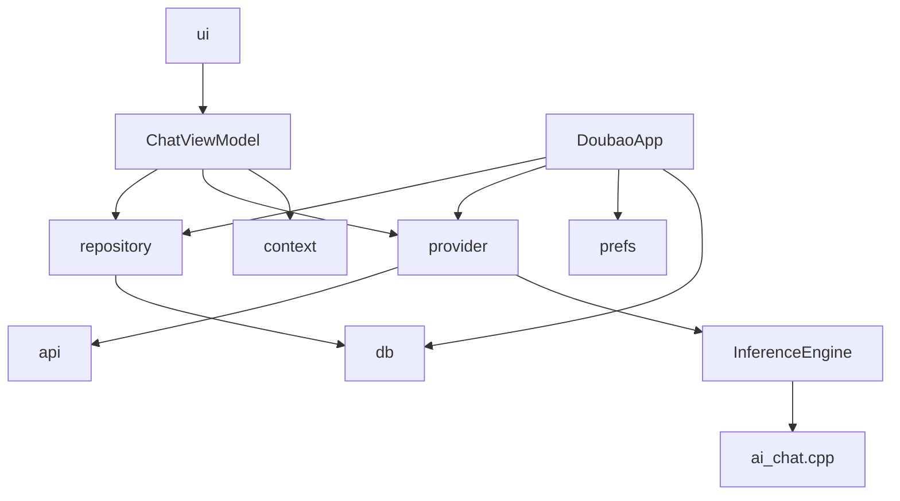
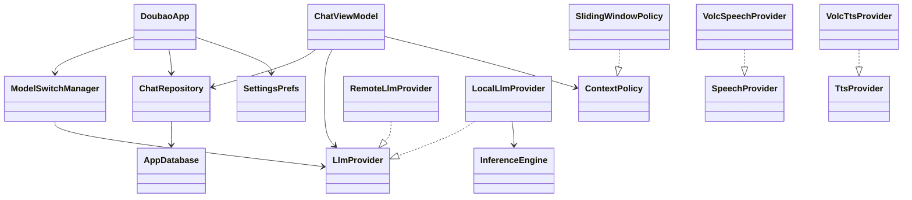
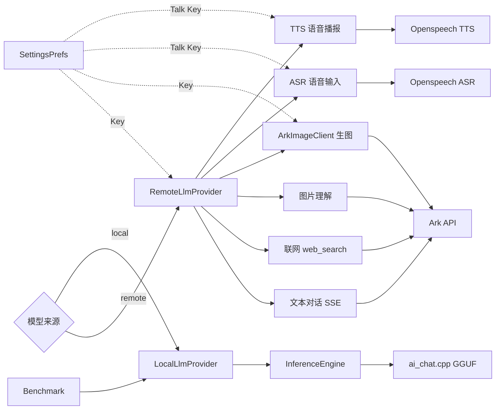
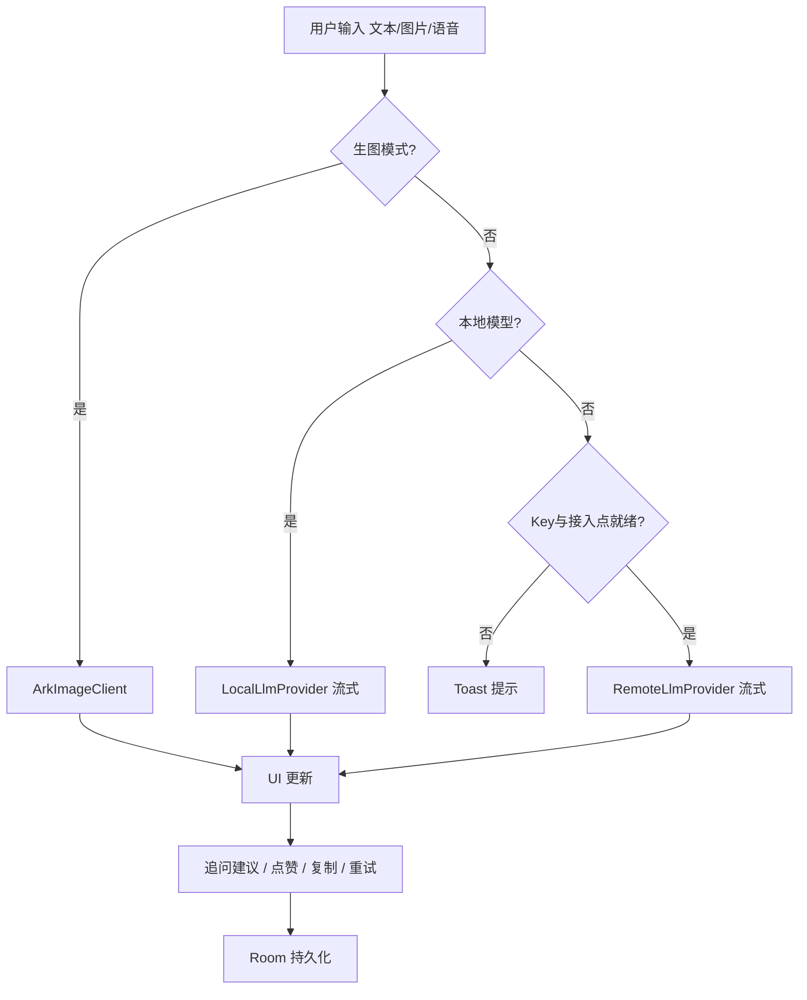
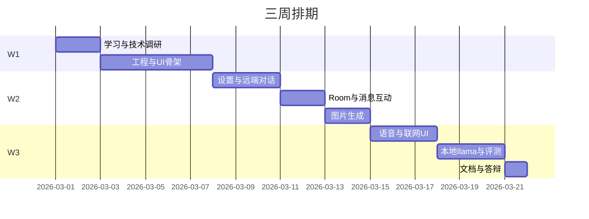

# DoubaoApp 技术文档

> Android 13+ · 远端火山方舟 + 本地 llama.cpp 双模 AI 聊天

---

## Part 1：分析实现方式

### 1.1 项目目标

- **交互**：多会话、流式回复、追问建议、复制/点赞/重试
- **双模推理**：远端 Ark API ↔ 本地 GGUF（`ModelSwitchManager` 切换）
- **能力分层**：远端支持联网、识图、生图、ASR/TTS；本地仅文本，切换时自动禁用不兼容功能
- **安全**：Room 持久化聊天；API Key 加密存设备，不入源码/APK

### 1.2 模块与架构

| 模块 | 职责 |
|------|------|
| `:app` | Compose UI、ViewModel、Repository、Provider、Room |
| `:llama-android-lib` | llama.cpp JNI（`ai-chat`） |

**分层**：Compose → `ChatViewModel` → `ChatRepository` / `LlmProvider` / `ContextPolicy` → Room / OkHttp / JNI

`DoubaoApp` 作轻量服务定位器（无 Hilt）：装配 Room、Provider、`SettingsPrefs`，`reconfigureRemoteServices()` 热更新远端配置。

**要点**：
- `LlmProvider` 抽象远端/本地，`ChatViewModel` 无实现分支
- `SlidingWindowPolicy` 保留最近 20 条 + token 估算裁剪
- Key 存 `EncryptedSharedPreferences`，接入点存普通 SharedPreferences

### 1.3 核心实现

| 模块 | 实现要点 |
|------|----------|
| **远端对话** | OkHttp SSE；普通 `/chat/completions`，联网 `/responses` + `web_search`；多模态 `image_url` |
| **本地对话** | `buildPrompt()` 拼多轮历史 → `resetConversationContext()` → JNI `sendUserPrompt(512)`；context 2048 / temp 0.7 |
| **生图** | `ArkImageClient` → `/images/generations`，接入点 `ep-xxx` |
| **语音** | `VolcSpeechProvider` ASR、`VolcTtsProvider` TTS（Talk Key，WebSocket） |
| **持久化** | `messages` / `sessions` 两表；用户消息即时写入，助手消息流式结束后写入 |
| **评测** | `LocalLlmBenchmark`：加载、bench、TTFT、稳定性、效果题 → Markdown 报告 |

### 1.4 技术栈

Kotlin · Compose · Navigation · ViewModel · Room · Coroutines/Flow · OkHttp(SSE/WebSocket) · Gson · Coil · EncryptedSharedPreferences · llama.cpp JNI

---

## Part 2：UML 结构

### 2.1 包依赖



### 2.2 核心类图



### 2.3 导航与本地状态

**路由**：`sessionList`（首页）→ `chat/{sessionId}` / `settings` → `localLlmBenchmark`

**本地模型状态**：`NoModel` → `Loading` → `Ready` ⇄ `Generating`；异常进 `Error`

---

## Part 3：主要流程图

### 为什么你看到的是代码而不是图？

文档里用的是 **Mermaid** 语法（` ```mermaid ` 代码块）。它只是「图的源代码」，**不是图片文件**。  
普通文本编辑器 / Cursor 默认 Markdown 预览 **不会自动画图**，所以你会看到一堆代码。

**查看渲染后的图形，任选一种方式：**

| 方式 | 操作 |
|------|------|
| **GitHub** | 把仓库 push 后，在网页打开 `docs/TECHNICAL.md`，GitHub 会自动渲染 Mermaid |
| **Mermaid Live** | 打开 [mermaid.live](https://mermaid.live)，把下面代码块复制粘贴进去 |
| **VS Code / Cursor 插件** | 安装扩展 **Markdown Preview Mermaid Support**，再用预览（`Ctrl+Shift+V`） |
| **Typora / Obsidian** | 直接打开 md 文件，内置支持 Mermaid |

> 原先单张图节点过多，部分预览器会渲染失败。下面已拆成 **3 张 PNG 图片 + 1 张 ASCII 总览**；§3.2–3.4 可直接看图，无需 Mermaid 渲染。

---

### 3.1 整体框架总览（ASCII · 直接可见）

```
┌─────────────────────────────────────────────────────────────────────────────┐
│  MainActivity → DoubaoApp（Room / Repository / Provider / SettingsPrefs）    │
└───────────────────────────────────┬─────────────────────────────────────────┘
                                    ▼
┌─────────────────────────────────────────────────────────────────────────────┐
│  UI 层（Navigation Compose）                                                 │
│  SessionListScreen ──→ ChatScreen ──→ SettingsScreen ──→ BenchmarkScreen   │
│     多会话列表           聊天+InputBar      Key/模型/GGUF      端侧性能评测   │
└───────────────────────────────────┬─────────────────────────────────────────┘
                                    ▼
┌─────────────────────────────────────────────────────────────────────────────┐
│  ChatViewModel（ChatUiState）                                                │
│  发送/重试/追问 · 语音/生图编排 · 点赞复制 · 流式 UI 更新                    │
└───────┬─────────────────┬──────────────────────┬────────────────────────────┘
        ▼                 ▼                      ▼
 ModelSwitchManager   ChatRepository        SlidingWindowPolicy
 remote ⟷ local      Room 持久化            上下文裁剪
        │                 │
   ┌────┴────┐            └── sessions / messages 表
   ▼         ▼
┌──────────────┐  ┌──────────────────────────────────────────────────────────┐
│ ⑤ 远端能力   │  │ ⑥ 端侧能力（llama.cpp）                                   │
│ RemoteLlm    │  │ LocalLlmProvider → InferenceEngine JNI → ai_chat.cpp    │
│  ·文本对话SSE│  │  ·GGUF 加载 · buildPrompt · 流式文本                      │
│  ·联网搜索   │  │ LocalLlmBenchmark：加载/TTFT/bench/稳定性/效果题报告      │
│  ·图片理解   │  │ ※ local 模式自动禁用：联网·生图·识图·ASR·TTS              │
│ ArkImage生图 │  └──────────────────────────────────────────────────────────┘
│ VolcSpeech   │
│  ASR语音输入 │
│ VolcTts TTS  │
└──────┬───────┘
       ▼
┌─────────────────────────────────────────────────────────────────────────────┐
│  ⑧ 火山引擎云端                                                              │
│  Ark API v3（对话/联网/识图/生图）  ·  Openspeech ASR/TTS WebSocket          │
└─────────────────────────────────────────────────────────────────────────────┘
       ▲
┌──────┴──────────────────────────────────────────────────────────────────────┐
│  ⑦ 数据层：SettingsPrefs（Ark Key/Talk Key 加密）+ 接入点 ep-xxx + 模型路径   │
└─────────────────────────────────────────────────────────────────────────────┘
```

---

### 3.2 分层架构与页面导航（Mermaid 图 ①）

```mermaid
flowchart TB
    MA[MainActivity] --> DA[DoubaoApp]
    DA --> SL[SessionListScreen 会话列表]
    DA --> PREFS[SettingsPrefs]
    SL --> CS[ChatScreen 聊天]
    CS --> SS[SettingsScreen 设置]
    SS --> BM[BenchmarkScreen 评测]
    CS --> CVM[ChatViewModel]
    SL --> CVM
    CVM --> MSM[ModelSwitchManager]
    CVM --> REPO[ChatRepository]
    CVM --> CTX[SlidingWindowPolicy]
    REPO --> ROOM[(Room DB)]
    PREFS --> ENC[EncryptedPrefs Key]
    PREFS --> EP[接入点与模型路径]
```




---

### 3.3 双模能力与云端对接（Mermaid 图 ②）




---

### 3.4 用户发送消息流程（Mermaid 图 ③）




### 3.5 补充：消息持久化要点

- **写**：用户消息即时 `insert`；流式中只更新 `StateFlow`；结束后 `insert` 助手消息
- **读**：`loadSession` → `getMessagesBySession`，仅 `messages.isEmpty()` 时写入 UI

---

## Part 4：工作拆分 + 排期

**周期**：单人开发，**3 周**。

| 周次 | 主题 | 主要任务 | 验收 |
|------|------|----------|------|
| **第 1 周** | 学习 + 框架 | Compose/Ark/llama 预习；工程初始化；会话列表+聊天 UI；`ChatViewModel`/`LlmProvider`/`DoubaoApp` 骨架 | App 可运行，四页可导航 |
| **第 2 周** | 远端基础 | 设置页+加密 Key；`RemoteLlmProvider` SSE 对话；Room 多会话；点赞/重试/追问；`ArkImageClient` 生图 | 远端对话可持久化，生图可用 |
| **第 3 周** | 进阶 + 端智能 | TTS/ASR；联网+识图+UI 优化；`LocalLlmProvider`+GGUF 切换；评测+真机测试；文档与提交 | 双模可用，演示通过 |



**依赖**：W1 框架 → W2 远端 → W3 进阶；本地 llama 依赖 W1 架构 + W2 设置页。

**主要风险**：W3 任务密 → 优先保证远端全功能 + 本地基础对话；NDK 问题 W1 提前预习 llama.android。

---

## 附录

| 类 | 路径 |
|----|------|
| `DoubaoApp` / `ChatViewModel` | `app/.../` |
| `RemoteLlmProvider` / `LocalLlmProvider` | `app/.../data/provider/` |
| `ChatRepository` / `SettingsPrefs` | `app/.../data/repository/` · `prefs/` |
| `InferenceEngine` / `ai_chat.cpp` | `llama/.../llama.android/lib/` |

| API | 地址 |
|-----|------|
| Ark | `https://ark.cn-beijing.volces.com/api/v3` |
| ASR | `wss://openspeech.bytedance.com/api/v3/sauc/bigmodel` |
| TTS | `wss://openspeech.bytedance.com/api/v3/tts/bidirection` |

*文档版本：1.3*
